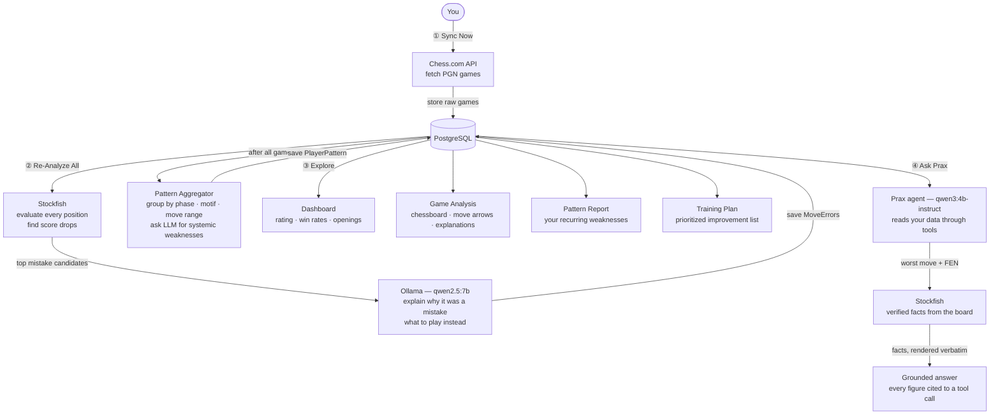

# Praxis-Chess


A personal, fully offline chess analytics and improvement system. Connect your Chess.com account, let the AI analyze your games, identify your recurring weaknesses, and generate a training plan tailored to your actual play — not generic advice.

Built with **Java 26 + Spring Boot 3.5**, **PostgreSQL**, **Stockfish**, **Ollama (local LLM)**, and **React**. No cloud AI. No deployment. Runs entirely on your machine.

---

## What It Does

### Dashboard

Your chess at a glance — rating trend over time, win/loss/draw breakdown, opening distribution, and accuracy stats across your recent games.

### Game Analysis

Select any fetched game and get move-by-move coaching. Every mistake is flagged with its severity (blunder, mistake, inaccuracy), the better move, and a plain-English explanation of _why_ — powered by Stockfish evaluation + local LLM.

### Insights

Practical analytics that show where your rating actually leaks: winning-position **conversion rate**, **time-trouble blunder rate**, an **accuracy trend** with a 10-game rolling average, win rate **vs. opponent strength**, **time-of-day / day-of-week** performance, **missed-tactic** frequency, **tilt** (how you play after a loss), and per-opening win rate + accuracy. Everything is derived from data already captured during analysis.

### Drills

Turns analysis into practice. Every blunder with a known engine best move becomes a puzzle — you replay your own losing position and try to find the move you missed, validated live against the engine.

### Pattern Report

Cross-game aggregation. Instead of per-game feedback, this tells you what _keeps_ happening: which move range you blunder in most, which tactical motifs catch you repeatedly, and where your opening preparation breaks down.

### Training Plan

The AI reads your Pattern Report and generates a prioritized, concrete improvement list — specific openings to drill, tactical patterns to study, positional habits to fix. Regenerates on demand.

### Ask Prax

A local reasoning agent with tool access to your own game history. Ask "show me my worst blunder and explain why it was bad" and it queries your database, runs Stockfish on the position, and answers from what it found — citing every figure back to the tool call that produced it.

Its chess claims are **computed, not generated**. The engine and the board produce a closed set of verified statements; the model chooses which are relevant and the backend prints them verbatim. A claim with no fact behind it has no id to cite and never reaches you. When the evidence doesn't support an explanation, Prax says so instead of inventing one.

### Play & Improve

Play a game against an opponent **built from your own history** — it opens with
the line you have faced most, at an engine strength picked from your results —
then get the same measurements applied to the game you just played. Every line
of the pre-game card is a count from your own games, and where there is not
enough history it says so rather than inventing a justification.

The report compares practice games only against **other practice games**.
Chess.com games are a different population, and a comparison across that gap is
arithmetically fine and means nothing. Below five comparable games it shows the
numbers and explicitly declines to claim a direction.

### Web research, when your own games have nothing

Ask "what is the Nimzowitsch-Larsen Attack?" and there is no row in your database
that answers it. Prax searches the web through a **self-hosted SearXNG** — no API
key, and nobody else sees your queries — reads the pages, and answers with
numbered sources you can check.

The interesting part is what it does when it *can't*. Prax will not answer a
factual question from the model's own memory: if no evidence reached the run
through a tool, it refuses and says so. This exists because it once produced a
fluent biography of **"Pal Benyamin Larsen"**, a chess player who does not exist.

### Practice streaks

A week grid and a running streak, counting only work that means something — a
drill session completed or a practice game played. Opening the app is not
practice. The server decides what "today" is, so a browser in another timezone
or left open past midnight cannot silently break or inflate the count.

### Prax — the presence

Prax is also visible: ~2,500 points rendered in WebGL as a single draw call, present on every page. The surface is an icosphere displaced along its own normals by noise sampled **every frame on the GPU**, so it genuinely reorganises rather than sitting still with jitter on top. It thickens and churns while analysis runs, contracts sharply on an insight, sweeps during evaluation, and narrates progress from real event counts — never from the model.

Local text-to-speech (Kokoro-82M, CPU-only) is built end-to-end but **not currently reachable from the UI** — the button that triggers it was never mounted. See [SPEECH_IMPLEMENTATION_PLAN.md](SPEECH_IMPLEMENTATION_PLAN.md).

---

## Tech Stack

| Layer           | Technology                             | Version           |
| --------------- | -------------------------------------- | ----------------- |
| Backend         | Java + Spring Boot                     | Java 26, SB 3.5.3 |
| Chess engine    | Stockfish (AVX2 binary)                | —                 |
| Analysis LLM    | Ollama + `qwen2.5:7b`                  | —                 |
| Reasoning LLM   | Ollama + `qwen3:4b-instruct`           | tool calling      |
| Text-to-speech  | Kokoro-82M ONNX (CPU, FastAPI sidecar) | optional          |
| Database        | PostgreSQL (Docker)                    | 17                |
| PGN parsing     | chesslib (`bhlangonijr`)               | 1.3.3             |
| Data source     | Chess.com Public API                   | free, no key      |
| Frontend        | React + TypeScript + Vite              | React 18          |
| Server state    | TanStack Query                         | v5                |
| Charts          | Recharts                               | —                 |
| Chess board     | react-chessboard + chess.js            | —                 |
| Prax rendering  | Three.js (`Points` + custom GLSL)      | —                 |

Two LLM roles, two models. The analysis models run in batch; the reasoning model runs interactively. Sharing one would make a long re-analysis block every question you ask — and on a 4 GB card they cannot both be resident.

---

## How It All Connects



> For low-level internals : thread model, data model, AI reasoning flow, design decisions, see [ARCHITECTURE.md](ARCHITECTURE.md)

---

## How Analysis Works

Analysis runs in four stages, entirely offline:

**Stage 1 — Stockfish bulk evaluation**
Every position is evaluated at `movetime 100` with Stockfish, skipping the first 6 full moves of opening book. Centipawn score drops ≥ 1.0 pawn are flagged as mistake candidates (max 8 per game). Severity is computed in Java — never by the LLM.

**Stage 2 — Deep MultiPV enrichment per candidate**
Each candidate gets a depth-18 Stockfish search with `MultiPV 3`, capturing the engine's top 3 continuation lines. This determines the `better_move` (UCI format) and engine lines fed into the LLM prompt.

**Stage 3 — Ollama explains (overlapped with Stage 2)**
The top 3 candidates are explained by `qwen2.5:7b`. The prompt includes the FEN, the move played, Stockfish's best reply, the eval delta in pawns, and the engine's top lines. The LLM's job is limited to explaining *why* — severity and the better move are already determined by Stockfish.

Stages 2 and 3 run in parallel via a `LinkedBlockingQueue`: the main thread runs Stockfish MultiPV on candidate N+1 while a consumer thread calls Ollama for candidate N.

```json
{
  "explanation": "Allows Bxf7+ winning the exchange; the engine's Nd5 maintains central control.",
  "tactical_motif": "HANGING_PIECE"
}
```

**Stage 4 — Pattern aggregation**
After all games are analyzed, error statistics (by phase, move range, motif, opening, time pressure) are compiled and sent to the LLM once to identify systemic weaknesses across your full game library.

Ollama is called with `"format": "json"` (grammar-constrained mode) — output is always parseable, never a wall of text.

---

## How Ask Prax Works

A separate path from the analysis pipeline. The pipeline writes rows; Prax reads them and reasons over them, in a loop bounded to **6 turns, 10 tool calls, 120 seconds**.

**1 — Tools, not memory.** Eleven read-only tools expose your data (a twelfth, `web_search`, is offered only on questions your own games cannot answer): player profile, opening and phase performance, mistake patterns, game lookup, drill progress, and `find_mistakes`, which returns your worst individual moves ordered by how much win probability each one cost. Prax may not answer from its own knowledge; it must call something.

**2 — The engine is chained automatically.** `find_mistakes` names the move but cannot say why it was bad, so the backend runs `analyze_position` on the worst row without waiting to be asked. That call appears as its own step with its own citation id — visible, not hidden.

**3 — Facts are computed, not written.** `analyze_position` returns a closed set of statements derived from the board with chesslib: what the played move allows, what it cost against the engine's choice, what is attacked, defended, or hanging. Every evaluation names the side ("Black is ahead by 6.92 pawns") so there is no perspective to invert.

**4 — The model selects; the backend renders.** The reply carries fact ids, not fact text. Chosen statements are printed word for word above the prose. Every number in the prose must cite the tool call it came from, and citations that don't resolve are dropped before you see them.

```json
{
  "findings": [
    "The move played was Rc7. It allows a forced mate for White.",
    "The engine's preferred move is Rb8."
  ],
  "evidence": [
    { "label": "Engine evaluation before the move",
      "value": "Black is ahead by 6.9 pawns", "source": "ENGINE" }
  ]
}
```

---

## Prerequisites

- **Java 26+** (JDK 26)
- **Docker** (for PostgreSQL)
- **[Ollama](https://ollama.com)** installed and running
- **Stockfish** binary (AVX2 build recommended)
- **Node.js 18+** (frontend)
- **Python 3.10+** — optional, only for the Prax voice service

---

## Getting Started

### 1. Clone the repository

```bash
git clone https://github.com/Praxis-Chess/Praxis-Chess.git
cd Praxis-Chess
```

### 2. Start everything (the short way)

```bash
./infra-up.sh            # PostgreSQL + SearXNG + Ollama
./infra-up.sh --tts      # ...and the voice service
./infra-down.sh          # stop it all
```

The steps below are the same thing by hand, if you would rather see them.

#### Local secrets

- **Database password** — copy `.env.example` to `.env` and choose a password
  before the first `docker compose up`. PostgreSQL is published on
  `127.0.0.1` only. Without a `.env`, a public development default is used.
- **SearXNG key** — `searxng/settings.yml` is generated by `./infra-up.sh`
  from `searxng/settings.example.yml`, with a random `secret_key`. Delete it
  and re-run `./infra-up.sh` to rotate the key.

#### Changing the database password

`POSTGRES_PASSWORD` only applies when the data volume is first created. For an
existing database, change it in place, then update `.env` and the `password`
in your `backend/src/main/resources/application.yml` to match:

```bash
docker exec -it praxis-chess-postgres psql -U praxis_chess_user -d praxis_chess -c '\password praxis_chess_user'
```

### 2a. Start PostgreSQL via Docker

```bash
cd backend/infra/dev-postgresql
docker compose up -d
```

### 3. Pull the LLM models

```bash
ollama pull qwen2.5:7b
```

```bash
ollama pull qwen3:4b-instruct
```

The second is the Prax reasoning agent and must support tool calling. Use the
`-instruct` tag specifically — plain `qwen3:4b` resolves to the *Thinking*
variant, which spends its whole output budget inside `<think>` and returns an
empty answer.

### 4. Configure the application

```bash
cp backend/src/main/resources/application.example.yml \
   backend/src/main/resources/application.yml
```

Edit `application.yml` with your values:

```yaml
spring:
  datasource:
    url: jdbc:postgresql://localhost:5432/praxis_chess
    username: praxis_chess_user
    password: your_password

praxis-chess:
  ollama:
    base-url: http://localhost:11434
    model: qwen2.5:7b
    # Prax chat agent — kept separate so a batch run and a live
    # conversation never compete for VRAM. Must support tool calling.
    reasoning-model: qwen3:4b-instruct
  chess-com:
    username: your_chess_com_username
  stockfish:
    path: /path/to/stockfish
  tts:
    enabled: true                    # optional — Prax works silently without it
    base-url: http://127.0.0.1:8087
```

### 5. Run the backend

```bash
cd backend
./mvnw spring-boot:run
# Runs on http://localhost:8086
```

### 6. Run the frontend

```bash
cd frontend
npm install
npm run dev
# Opens on http://localhost:5173
```

### 7. (Optional) Run the voice service

```bash
cd tts-service
pip install -r requirements.txt
python main.py
# Runs on http://127.0.0.1:8087
```

Gives Prax a voice via Kokoro-82M. Runs **on CPU by design** — the GPU is
reserved for Ollama. Skip it entirely and Prax stays silent but fully
functional; the frontend hides the control when `/api/voice/status` reports
unavailable.

---

## Project Structure

```
praxis-chess/
├── backend/
│   ├── src/main/java/com/praxis/
│   │   ├── api/                    # REST controllers
│   │   ├── config/                 # AppProperties, async executor config
│   │   ├── domain/                 # JPA entities + enums
│   │   ├── dto/                    # Request / response DTOs
│   │   ├── pipeline/               # AnalysisPipelineOrchestrator + ProgressTracker
│   │   ├── prax/                   # Reasoning agent — see ARCHITECTURE.md
│   │   │   ├── intelligence/       # ChessIntelligence — deterministic analytics
│   │   │   ├── tools/              # ToolRegistry + JSON schemas for Ollama
│   │   │   ├── chat/               # PraxAgent loop, prompt, response contract
│   │   │   └── evidence/           # PositionEvidenceBuilder, ChessFact, Evidence
│   │   ├── repository/             # Spring Data JPA repositories
│   │   └── service/
│   │       ├── ai/                 # OllamaAnalysisClient, PromptTemplates
│   │       ├── analysis/           # PGN parser, Stockfish evaluator, mistake filter
│   │       ├── chesscom/           # Chess.com API client, SyncService, AsyncSyncService
│   │       ├── drills/             # SessionEngineService — FSRS scheduling
│   │       └── voice/              # TtsClient — talks to the sidecar
│   └── src/main/resources/
│       ├── application.example.yml # Safe template (committed)
│       └── application.yml         # Your secrets (gitignored)
├── frontend/
│   └── src/
│       ├── api/                    # API client + TypeScript types
│       ├── components/             # SyncStatusBanner, ChessBoard, charts
│       ├── hooks/                  # useAnalysisProgress, useSyncStatus
│       ├── prax/                   # Particle presence — renderer, motion, state, voice, UI
│       └── pages/                  # Today, Progress, Library, Session, Insights,
│                                   #   Dashboard, GameList, GameAnalysis, Drills,
│                                   #   PatternReport, TrainingPlan
├── tts-service/                    # Kokoro-82M FastAPI sidecar (optional, CPU-only)
└── ARCHITECTURE.md                 # Full design decisions + Mermaid diagrams
```

---

## Roadmap

- [x] Chess.com API integration + game sync
- [x] PGN parsing pipeline (chesslib)
- [x] Stockfish position evaluation
- [x] Structured Ollama analysis engine (JSON mode)
- [x] Async sync + live progress banner with ETA
- [x] Game Analysis page (chessboard + move arrows)
- [x] Pattern aggregation engine
- [x] Training plan generator
- [x] Dashboard with rating chart + opening breakdown
- [x] Per-game transaction commits (resume after JVM kill)
- [x] Engine-computed severity + MultiPV evidence-rich prompts
- [x] CPU/GPU overlap via BlockingQueue pipeline
- [x] ACPL-based accuracy when Chess.com doesn't provide it
- [x] Analyze Pending button (non-destructive resume after interruption)
- [x] Insights page (conversion, time management, tilt, opponent strength, trends)
- [x] Drills — practice your own blunders as puzzles
- [x] Spaced-repetition scheduling for drills (FSRS)
- [x] Prax presence — WebGL particle system, one draw call, deterministic narration
- [x] Ask Prax — tool-calling agent over your own game history
- [x] Citation validation — uncited figures dropped before display
- [x] Verified chess facts computed from the board, rendered verbatim
- [x] Local text-to-speech (Kokoro-82M, CPU-only) — built, not yet wired to a button
- [x] Conversation memory persisted to Postgres, scoped per thread
- [x] The grounding invariant — a factual answer ships only if evidence reached the run through a tool
- [x] Question routing by lane; `web_search` is *absent* from the tool list on player questions
- [x] Web research via self-hosted SearXNG, with SSRF defence and per-hop redirect validation
- [x] Prompt-injection defence by capability removal — no tools offered once web text is in context
- [x] Ask Prax workspace — runs polled progressively, boards/charts/tables as artifacts
- [x] Play & Improve — practice games against an opponent built from your own history
- [x] Practice streaks with a server-owned "today"
- [x] Prax visual rework — icosphere point cloud, displacement sampled per frame on the GPU
- [x] Test suites: 176 backend (mutation-tested) + 200 Playwright, mocked and live
- [ ] **Speech** — mount the trigger surface; the stack behind it already works
- [ ] Voice input — mic capture for Ask Prax
- [ ] Generate drill cards when analysis finishes, not only when a session starts
- [ ] Backend tests in CI (the workflow is currently Playwright-only)
- [ ] True HYBRID answers that merge player data and web material honestly
- [ ] Knowledge retrieval for general chess principles — *declined pending usage evidence*
- [ ] Fine-tuned smaller model for faster inference

---

## Why Fully Offline?

Most AI chess tools require uploading your games to cloud services. Praxis-Chess takes a different approach.

Every analysis runs locally on your machine. Stockfish evaluates your positions, Ollama generates explanations and training plans, and PostgreSQL stores your data. Nothing is sent to external AI providers, and no account, subscription, or internet connection is required after your games have been synced.

The only outbound request is to the Chess.com Public API to download games from your own public profile. After that, every evaluation, pattern report, and training recommendation happens entirely offline.

This approach provides:

- **Privacy by default** : your games, evaluations, and improvement history never leave your computer.
- **No cloud dependency** : keep analyzing games even without an internet connection.
- **No API costs or rate limits** : run as many analyses as you want using your own hardware.
- **Full ownership of your data** : your database, engine, and AI model are all under your control.
- **Transparent architecture** : every component, from Stockfish to the local LLM, is open and inspectable.

Praxis-Chess is designed as a personal chess improvement system, not a cloud service. You own the data, you run the analysis, and you decide when and how it operates.

---

## License

MIT
